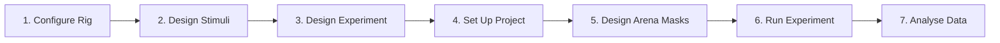

# Quick Start

This guide walks you through the complete workflow for running your first SixteenY experiment — from hardware setup to data collection.

---

## Workflow Overview



---

## Step 1: Configure the Rig

Launch the **Rig Configurator** to define your hardware setup:

```bat
run_rig_configurator.bat
```

In the Rig Configurator, set:

- Camera COM ports and configuration (Spinnaker)
- LED controller serial ports (`COM3`, `COM4`, `COM5`, `COM6`) and panel IDs
- Odor valve ROS2 connection settings
- MFC COM port and device IDs
- Arena-to-panel mapping

Save the configuration. This creates a `rig_config.json` file used by the Experimenter.

---

## Step 2: Design LED Stimuli

Launch the **Stimulus Designer** from the Project Manager or directly:

Define stimulus patterns with:

- **Pulse width** — duration of each individual pulse (ms)
- **Pulse period** — time between pulse onsets (ms)
- **Pulse count** — number of pulses per stimulus
- **Pulse delay** — delay before stimulus onset (ms)
- **Intensity** — LED intensity (0–100%)

Save each stimulus as a `.stim` file in your project's `stimulus_zoo/`.

---

## Step 3: Design an Experiment

Launch the appropriate experiment designer based on your paradigm:

=== "2AFC"
    Use the **2AFC Designer** for standard reward-probability tasks:

    - Define blocks of trials with configurable numbers of trials per block
    - Set reward probability for Odor 1 and Odor 2 per block
    - Enable L/R randomization and pre-sampling options
    - Save as a `.csv` experiment file

=== "DFSE"
    Use the **DFSE Designer** for Deterministic Finite-State Experiments:

    - Define discrete states with reward/no-reward labels
    - Create a state-transition matrix based on the fly's choice (Odor 1 or Odor 2)
    - Set the number of naive (un-rewarded) trials before the state machine begins
    - Save as a `.ymaze` experiment file

=== "DMLE"
    Use the **DMLE Designer** for Multi-Level experiments:

    - Extends DFSE with three reward levels: low, mid, and high
    - Assign different stimuli to each reward level
    - Save as a `.ymle` experiment file

---

## Step 4: Set Up a Project

Launch the **Project Manager**:

```bat
run_project_manager.bat
```

A project directory has the following structure:

```
my_experiment/
├── data/                  # Experiment output data
├── stimulus_zoo/          # .stim files
├── experiment_zoo/        # .csv / .ymaze / .ymle files
└── genotypes.log          # Fly genotype registry
```

Use the Project Manager to:
- Browse and organize experiments and stimuli
- Launch experiment and stimulus designers
- Trigger post-hoc data processing

---

## Step 5: Design Arena Masks

Before running experiments, you must create an **arena mask** — a set of region-of-interest polygons that map pixel coordinates to Y-maze arms for all 16 arenas.

Launch the **Mask Designer**:

```bat
run_mask_designer.bat
```

1. Load a background frame captured from your camera
2. Enter the number of Y-arenas (16)
3. Click the center and arm tips of each arena to define keypoints
4. The tool automatically generates a mask and saves it as a `.npy` file

---

## Step 6: Run an Experiment

Launch the **Experimenter**:

```bat
run_experiment.bat
```

Configure the session:

1. Select your **project directory**
2. Enter an **experiment name** (optionally append a timestamp)
3. Select the **fly genotype** for each of the 16 arenas
4. Set the **starvation start time** for each arena
5. Select the **experiment file** (`.csv`, `.ymaze`, or `.ymle`) for each arena
6. Adjust **hardware settings** (camera exposure, LED scaling, MFC flow rates)
7. Set the **arena mask** file

Click **Start Experiment** to begin. The Experimenter will:

- Initialize all hardware controllers
- Capture a background frame
- Begin the tracking loop (GPU-accelerated)
- Deliver odor and LED stimuli according to each fly's choices
- Log all data to disk in real time
- Send email notifications at key milestones

---

## Step 7: Analyse Data

After the experiment, use the **Data Processor** from the Project Manager to:

- Align and clean trajectory data
- Compute choice fractions, response times, and reward rates
- Generate summary plots
- Export processed data to CSV

Use the **Video Generator** to create annotated video overlays of fly trajectories for visual inspection.

---

## Next Steps

- [Hardware Setup](hardware-setup.md) — detailed rig wiring and hardware configuration
- [Experiment Designers](../user-guide/experiment-designers.md) — in-depth guide to each paradigm
- [API Reference](../api-reference/controllers/camera.md) — Python API for custom scripting
