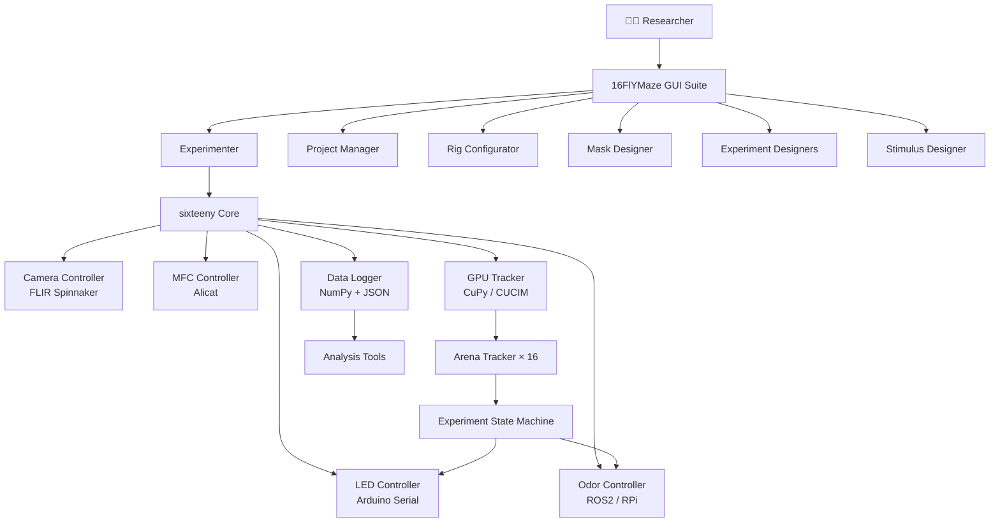

---
hide:
  - navigation
---

## *A High Throughput Two-Choice Assay for Drosophilids*

[🚀 Get Started](getting-started/installation.md){ .md-button .md-button--primary }
[📖 User Guide](user-guide/overview.md){ .md-button }
[📄 Full Documentation (PDF)](assets/16FlyMaze.pdf){ .md-button }

---

## What is 16FlYMaze?

**16FlYMaze** is a complete hardware-software platform for running automated optogenetic Two-Alternative Forced Choice (2AFC) behavioral experiments on *Drosophila melanogaster* and other drosophilids in **16 simultaneous Y-shaped arenas**.

The system was developed in the **Turner Lab at Janelia Research Campus (HHMI)** to enable high-throughput, reproducible behavioral neuroscience experiments that combine:

- **Odor discrimination** — two distinct odors delivered to the left and right arms of each Y-maze
- **Optogenetic reinforcement** — precisely timed LED light pulses delivered as conditioned stimuli
- **Automated tracking** — GPU-accelerated real-time detection of fly position and choice

 <em>CAD renders: arena stack (left) and full imaging rig with overhead FLIR camera (right)</em>

---

## Feature Highlights

-   :fontawesome-solid-microscope: **16 Simultaneous Arenas**

    ---

    Run identical or independent experiments on 16 Y-shaped arenas at once, maximizing throughput and enabling within-session comparisons.

-   :fontawesome-solid-bolt: **GPU-Accelerated Tracking**

    ---

    Real-time fly detection and position tracking using NVIDIA CUDA (CuPy & CUCIM), processing all 16 arenas at camera frame rate.

-   :fontawesome-solid-lightbulb: **Optogenetic Stimulation**

    ---

    Programmable LED pulse patterns (pulse width, period, count, delay, intensity) delivered via serial Arduino interface.

-   :fontawesome-solid-wind: **Automated Odor Delivery**

    ---

    Odor valve control over ROS2 / Raspberry Pi interface, with Alicat MFC flow rate management.

-   :fontawesome-solid-desktop: **Full GUI Suite**

    ---

    Seven dedicated PyQt5 applications — from hardware configuration and mask design to live experiment control and post-hoc analysis.

-   :fontawesome-solid-flask: **Multiple Paradigms**

    ---

    Support for 2AFC, Deterministic Finite-State (DFSE), and Multi-Level (DMLE) experiment designs, enabling diverse behavioral tasks.

-   :fontawesome-solid-envelope: **Email Notifications**

    ---

    Gmail API integration for remote experiment monitoring — receive alerts, progress reports, and completion notifications.

-   :fontawesome-solid-chart-bar: **Built-in Analysis**

    ---

    Automated post-hoc data processing, trajectory analysis, and video generation tools included out of the box.

---

## System Overview

---

## Quick Navigation

| I want to… | Go to… |
|---|---|
| Install the system for the first time | [Installation Guide](getting-started/installation.md) |
| Understand the typical workflow | [Quick Start](getting-started/quickstart.md) |
| Set up the hardware | [Hardware Setup](getting-started/hardware-setup.md) |
| Configure the rig | [Rig Configurator](user-guide/rig-configurator.md) |
| Design a new experiment | [Experiment Designers](user-guide/experiment-designers.md) |
| Run an experiment | [Experimenter](user-guide/experimenter.md) |
| Analyse collected data | [Analysis Tools](user-guide/analysis.md) |
| Browse the Python API | [API Reference](api-reference/controllers/camera.md) |

---

## Team & Contributors

16FlYMaze was designed and built by a multidisciplinary team led by **Glenn Turner's Lab** at **Janelia Research Campus, Howard Hughes Medical Institute (HHMI)**, with funding from HHMI:

| Name | Affiliation | Role |
|---|---|---|
| **Rishika Mohanta** | Janelia Research Campus, HHMI | Project Lead · Software · Design · Final Assembly |
| **Glenn Turner** | Janelia Research Campus, HHMI | Head of Lab · Original Design |
| **Adithya Rajagopalan** | Janelia Research Campus, HHMI | Original Design |
| **Tzuhsuan Ma** | Janelia Research Campus, HHMI | Experiment Design |
| **Ann Hermundstad** | Janelia Research Campus, HHMI | Experiment Design |
| **Kevin Miller** | Google DeepMind | Experiment Design |
| **Maria Eckstein** | Google DeepMind | Experiment Design |
| **Peter Polidoro** | Janelia Research Campus, HHMI | Pneumatics · Electrical · Assembly |
| **Steven Sawtelle** | Janelia Research Campus, HHMI | Optics |
| **Tobias Goulet** | Janelia Research Campus, HHMI | Pneumatics · Electrical · Assembly |
| **Jeff Talbot** | Janelia Research Campus, HHMI | Pneumatics · Electrical · Assembly |
| **Katie Boone** | Janelia Research Campus, HHMI | Experimenter |
| **Aparna Dev** | Janelia Research Campus, HHMI | Experimenter |
| **Claire Manangan** | Janelia Research Campus, HHMI | Experimenter |

---

## License

16FlYMaze is released under the **BSD 3-Clause License**.  
Copyright © 2022 Rishika Mohanta, Turner Lab, Janelia Research Campus, HHMI.

