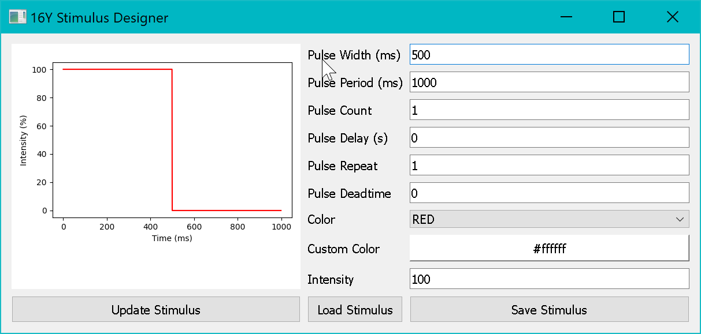

# Analysis Tools

SixteenY includes built-in post-hoc analysis and visualization tools that are launched from the **Project Manager**.

---

## Data Processor


*The 16Y Data Processor GUI for post-hoc analysis of completed experiments.*

The **Data Processor** (`16Y_data_processor.py`) provides a GUI for loading, cleaning, and analyzing data from completed experiments.

### Launching

Select one or more completed experiments in the Project Manager's **Experimental Data** panel, then click **Process Data**.

### Processing Pipeline

#### 1. Load Raw Data

The Data Processor reads per-arena tracking arrays (`tracking.npy`) and experiment logs (`experiment_log.json`) from each arena folder.

#### 2. Trajectory Alignment

Fly position trajectories are aligned into a canonical coordinate frame:

- **L/R Alignment** — Positions are rotated so that the start arm is always at the bottom, left arm on the left, and right arm on the right.
- **Odor Alignment** — Positions can be re-aligned so that Odor 1 is always on the left, accounting for L/R randomization.

```python
# Left-Start-Right coordinate realignment
realign_lr(start_arm, point, arena_index)

# Odor 1-Start-Odor 2 coordinate realignment
realign_odor(odor_vector, point)
```

#### 3. Computed Metrics

Per trial and per session, the processor computes:

| Metric | Description |
|---|---|
| **Choice Fraction** | Fraction of trials where Odor 1 (or left) was chosen |
| **Response Time** | Time from trial start to arm entry |
| **Reward Rate** | Fraction of trials where reward was delivered |
| **Dwell Time** | Time spent in the chosen arm |
| **Trial Length** | Total duration of each trial |

#### 4. Export

Processed data is exported to CSV files in the experiment folder for downstream analysis (e.g., in Jupyter notebooks or R).

---

## Video Generator

The **Video Generator** (`16Y_video_generator.py`) creates annotated trajectory video overlays.

### Launching

Select experiments in the Project Manager and click **Generate Video**.

### Output

For each experiment, the Video Generator produces an `.mp4` video showing:

- Raw camera frames (or a background image)
- Fly trajectory overlay per arena
- Arena mask overlay (arm boundaries)
- Trial and choice annotations

Videos are saved to the experiment folder using FFMPEG.

---

## Manual Analysis

For custom analysis, the raw data files are directly accessible:

### Tracking Array Schema

Load with NumPy:

```python
import numpy as np
data = np.load("arena_0/tracking.npy", allow_pickle=True).item()

# Available fields:
data["fly_positions"]               # (N, 2) - x/y pixel positions
data["frame_times"]                 # (N,)   - timestamps
data["current_arms"]                # (N,)   - arm index per frame
data["current_trials"]              # (N,)   - trial index per frame
data["current_reward_zone_status"]  # (N,)   - in reward zone (bool)
data["trial_start_times"]           # (T,)   - trial start timestamps
data["trial_end_times"]             # (T,)   - trial end timestamps
data["chosen_arms"]                 # (T,)   - chosen arm per trial
data["chosen_odor"]                 # (T,)   - chosen odor per trial
data["reward_delivered"]            # (T,)   - reward delivered (bool)
data["odor_vectors"]                # (T, 3) - odor arm mapping per trial
```

### Experiment Log

The `experiment_log.json` contains the full trial-by-trial state history, including reward probabilities, stimulus assignments, and experimenter state.

```python
import json
with open("experiment_log.json") as f:
    log = json.load(f)
# log["states"] is a list of dicts, one per trial
```
