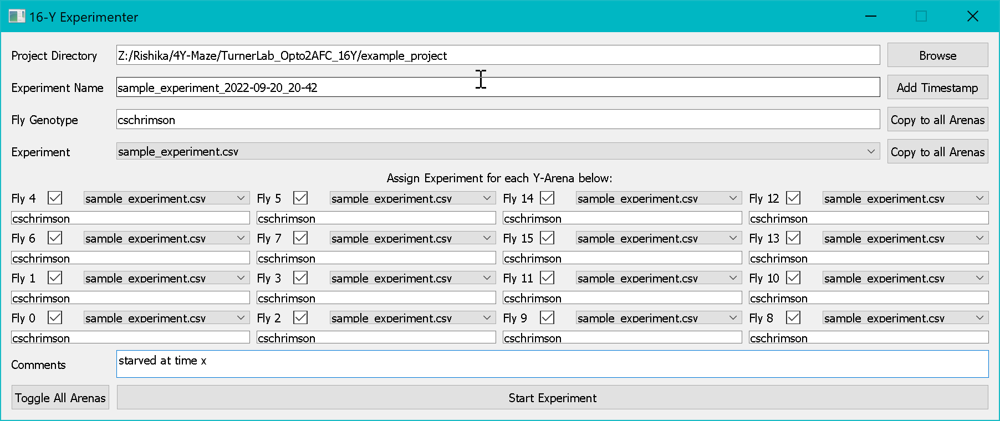

# Experimenter

The **16Y Experimenter** is the main application for running live behavioral experiments across all 16 arenas simultaneously.

---

## Launching

```bat
run_experiment.bat
```

---

## Overview


*The 16Y Experimenter GUI: assign genotypes and experiment files to each of the 16 arenas before starting a session.*

---

## Pre-experiment Setup

Before clicking Start, complete all sections of the Experimenter interface:

### 1. Project Directory

Click **Browse** to select your project folder. The Experimenter will load genotype history and look for experiment/stimulus files from this directory.

### 2. Experiment Name

Enter a descriptive name for the session. Click **Add Timestamp** to automatically append the current date and time — useful for keeping sessions uniquely identifiable.

### 3. Fly Genotypes

For each of the 16 arenas, select or type the fly genotype. Use **Copy Genotypes** to apply the same genotype to all arenas at once.

Previously used genotypes from `genotypes.log` appear in the dropdown.

### 4. Starvation Start Time

Enter the date and time when each fly (or cohort) was moved to starvation conditions. This is recorded in the metadata for downstream analysis.

Use **Quick Buttons** (e.g., "−16 h", "−24 h") to set relative starvation times quickly.

### 5. Experiment File

For each arena, select the experiment file (`.csv`, `.ymaze`, or `.ymle`) to run. Use the **Copy** button to apply the same file to all arenas.

### 6. Camera and Hardware Settings

| Setting | Description |
|---|---|
| **Mask File** | Path to the `.npy` arena mask |
| **Camera Index** | Which Spinnaker camera to use |
| **Exposure / Gain** | Camera acquisition parameters |
| **GPU Enabled** | Toggle GPU-accelerated tracking (recommended) |
| **LED Scaling** | Fine-tune per-arena LED intensity |
| **MFC Flow Rate** | Airflow rate override |
| **Email Notifications** | Toggle experiment progress emails |
| **Reminder Interval** | Frequency of email reminders after experiment end |

---

## Running an Experiment

Click **Start Experiment** when all settings are configured.

### Initialization Sequence

1. Hardware controllers are initialized (camera, LEDs, valves, MFCs)
2. IR backlights are turned on
3. A background frame is captured and saved
4. The GPU tracking pipeline is initialized

### Live Experiment Loop

For each camera frame:

1. Frame is acquired from the Spinnaker camera
2. GPU-accelerated change detection identifies fly positions
3. Each arena's `ArenaTracker` processes the fly position:
   - Determines which arm the fly is in
   - Detects reward-zone entries
   - Queries the experimenter for the next trial state
   - Issues odor and LED stimulus commands as appropriate
4. Frame and tracking data are saved asynchronously to disk

### Trial Logic

Each trial follows this sequence:

```
Fly enters arm
    ↓
Odor delivered (after optional odor delay)
    ↓
Fly stays in arm for required dwell time
    ↓
Reward evaluated (probabilistic)
    ↓
LED stimulus delivered (if reward)
    ↓
Trial logged, next trial loaded
    ↓
Fly returns to start arm → new trial begins
```

### Stopping the Experiment

Click **Stop Experiment** to gracefully end the session. The system will:

1. Complete any in-progress trials
2. Turn off all stimuli
3. Close hardware connections
4. Save all tracking data
5. Write experiment logs
6. Send a completion email notification

---

## Data Output

All data is saved to `<project_dir>/data/<experiment_name>/`:

```
experiment_name/
├── background.png             # Background frame used for tracking
├── experiment_config.json     # Full experiment configuration snapshot
├── arena_0/
│   ├── tracking.npy           # Position, arm, trial, reward data
│   ├── experiment_log.json    # Trial-by-trial state log
│   └── frames/                # Raw camera frames (if enabled)
├── arena_1/
│   └── ...
└── ...
```

### Tracking Data Format (`tracking.npy`)

The tracking array contains per-frame columns:

| Column | Description |
|---|---|
| `fly_x`, `fly_y` | Fly centroid position in pixels |
| `current_arm` | Current arm index (0=Start, 1=Left, 2=Right) |
| `current_trial` | Trial number |
| `in_reward_zone` | Boolean reward zone status |
| `frame_time` | Timestamp (seconds) |

---

## Email Notifications

If email is enabled, the system sends notifications at:

- Experiment start
- Every N trials completed (configurable)
- Experiment end / all arenas complete
- Periodic reminders if valves are left on after completion

Configure the Gmail API credentials as described in [Installation](../getting-started/installation.md).
