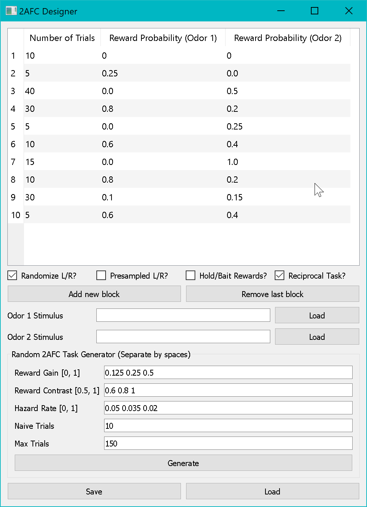

# Mask Designer

The **16Y Mask Designer** is a graphical tool for creating arena masks — pixel-coordinate maps that tell the tracking system where each Y-maze arm is in the camera image.

---

## Launching

```bat
run_mask_designer.bat
```

---

## Overview


*The Mask Designer's labelling interface showing all 16 arenas with numbered keypoints (center, start-arm tip, left-arm tip, right-arm tip) overlaid on the camera image.*

---

## What is an Arena Mask?

An arena mask is a NumPy array (`.npy`) that encodes, for every pixel in the camera image, which Y-maze arena and which arm (0=Start, 1=Left, 2=Right, or background) that pixel belongs to.

The tracker uses this mask to:

1. Determine which arm a fly is currently in
2. Detect when a fly enters the reward zone (arm tip)
3. Compute choice (left vs. right arm selection)

---

## Creating a Mask

### Step 1: Load a Background Image

Click **Get Background Image** and select a background frame captured from the camera (e.g., a `.png` exported during rig setup or from a test capture). The image will be displayed in the main viewer.

### Step 2: Set Parameters

| Parameter | Description |
|---|---|
| **Number of Y-Arenas** | Total arenas to label (typically 16) |
| **Choice Boundary Distance** | Distance from arena center to the choice boundary (pixels); defines when a fly has committed to an arm |

### Step 3: Label the Arenas

Click **Start Labelling** to begin the point-clicking interface.

For each arena, click the following keypoints **in order**:

1. **Center** — The junction point of the Y
2. **Start arm tip** — The tip of the start (bottom) arm
3. **Left arm tip** — The tip of the left arm
4. **Right arm tip** — The tip of the right arm

The tool draws the polygon mask and displays the labeled regions in real time.

!!! tip "Labelling Order"
    Label arenas systematically (e.g., left-to-right, top-to-bottom) to ensure the arena indices match the LED controller and valve controller numbering.

### Step 4: Review and Save

After labelling all arenas:

1. Click **Plot Mask** to visualize the complete mask overlaid on the background image
2. Click **Save Mask** to export the mask as a `.npy` file

---

## Tips

- **Camera must be fixed** — The mask is specific to the exact camera position and zoom. If the rig is moved, a new mask must be created.
- **Consistent keypoint order** — The tool assumes Start → Left → Right arm tip order.
- **Re-use masks** — As long as the rig geometry hasn't changed, the same mask can be re-used across all experiments.

---

## Output Format

The saved `.npy` mask is a 2D integer array with the same shape as the camera image:

| Value | Meaning |
|---|---|
| `-1` | Background (outside all arenas) |
| `3*i + 0` | Arena `i`, Start arm |
| `3*i + 1` | Arena `i`, Left arm |
| `3*i + 2` | Arena `i`, Right arm |

where `i` ranges from 0 to 15.
