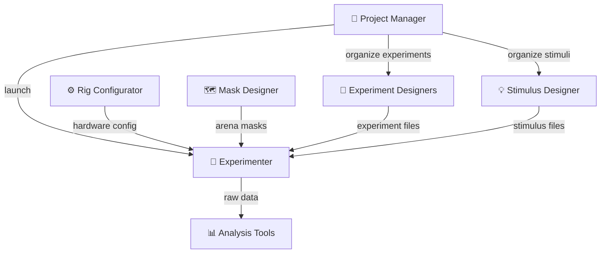

# User Guide Overview

The **16FlYMaze** system is operated through a suite of seven graphical applications, each designed for a specific stage of the experimental workflow.

---

## Application Suite

---

## Applications at a Glance

| Application | Launcher | Purpose |
|---|---|---|
| [Project Manager](project-manager.md) | `run_project_manager.bat` | Organize data, experiments, and stimuli |
| [Rig Configurator](rig-configurator.md) | `run_rig_configurator.bat` | Configure hardware COM ports and settings |
| [Mask Designer](mask-designer.md) | `run_mask_designer.bat` | Draw Y-arena ROI masks from camera images |
| [Experimenter](experimenter.md) | `run_experiment.bat` | Run live experiments with real-time tracking |
| [Experiment Designers](experiment-designers.md) | Launched from Project Manager | Design 2AFC, DFSE, and DMLE experiments |
| [Stimulus Designer](stimulus-designer.md) | Launched from Project Manager | Create LED pulse-pattern stimulus files |
| [Analysis Tools](analysis.md) | Launched from Project Manager | Post-hoc data processing and visualization |

---

## Typical Session Workflow

A typical experimental session follows this order:

1. **Configure the rig** (once, or after hardware changes)  
   → [Rig Configurator](rig-configurator.md)

2. **Design stimuli** (once per stimulus type)  
   → [Stimulus Designer](stimulus-designer.md)

3. **Design experiments** (once per paradigm)  
   → [Experiment Designers](experiment-designers.md)

4. **Set up a project** (once per experimental cohort)  
   → [Project Manager](project-manager.md)

5. **Create arena masks** (once, or after rig repositioning)  
   → [Mask Designer](mask-designer.md)

6. **Run experiments** (each session)  
   → [Experimenter](experimenter.md)

7. **Analyse data** (after each session or batch)  
   → [Analysis Tools](analysis.md)

---

## File Types

| Extension | Type | Created by |
|---|---|---|
| `.stim` | LED stimulus pattern (JSON) | Stimulus Designer |
| `.csv` | 2AFC experiment schedule | 2AFC Designer |
| `.ymaze` | DFSE experiment config (JSON) | DFSE Designer |
| `.ymle` | DMLE experiment config (JSON) | DMLE Designer |
| `.npy` | Arena mask array | Mask Designer |
| `rig_config.json` | Hardware configuration | Rig Configurator |
