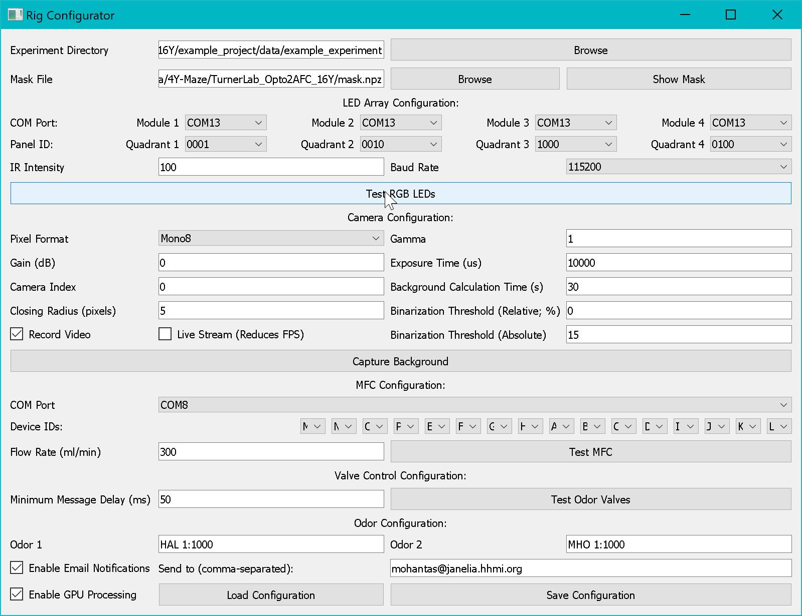

# Rig Configurator

The **16Y Rig Configurator** allows you to define and save all hardware settings for your specific rig setup.

---

## Launching

```bat
run_rig_configurator.bat
```

---

## Overview


*The 16Y Rig Configurator GUI showing LED, camera, MFC, and odor valve settings.*

The Rig Configurator stores all hardware configuration in a `rig_config.json` file that is loaded by the Experimenter at startup. You only need to reconfigure when hardware connections change.

---

## Configuration Sections

### Camera Settings

| Parameter | Description |
|---|---|
| **Camera Index** | Index of the Spinnaker camera to use (0 for first camera) |
| **Exposure Time** | Camera exposure time in microseconds |
| **Gain** | Camera analog gain |
| **Frame Rate** | Target acquisition frame rate (fps) |
| **Image Width / Height** | Camera resolution in pixels |
| **Pixel Format** | e.g., `Mono8` for 8-bit grayscale |

### LED Controller Settings

| Parameter | Description |
|---|---|
| **COM Ports** | List of 4 COM ports for the LED modules (e.g., `COM3`, `COM5`, `COM6`, `COM4`) |
| **Baud Rate** | Serial baud rate (default: 115,200) |
| **Panel IDs** | 4-character binary IDs identifying each module (`0001`, `0010`, `1000`, `0100`) |
| **IR/R/G/B Scaling Factors** | Per-channel intensity scaling (0.0–1.0) for each of the 16 arenas |
| **IR Intensity** | Default IR backlight intensity (0–100%) |

### Odor Valve Settings

| Parameter | Description |
|---|---|
| **Minimum Delay** | Minimum time (seconds) between valve commands (default: 0.1) |
| **ROS2 Configuration** | Network/domain settings for the Raspberry Pi interface |

### MFC Settings

| Parameter | Description |
|---|---|
| **COM Port** | Serial port for the Alicat MFC |
| **Device IDs** | List of MFC device address IDs |
| **Default Flow Rate** | Default flow rate (sccm) applied at initialization |

### Arena Layout

| Parameter | Description |
|---|---|
| **Arena Panel IDs** | Mapping from arena index (0–15) to LED panel module |
| **Clockwise Arenas** | List of arena indices with clockwise orientation (default: even indices) |

---

## Saving and Loading

- Click **Save Configuration** to write the current settings to `rig_config.json`
- The Experimenter automatically loads this file at startup
- Use **Load Configuration** to restore a previously saved config
- Use **Reset to Defaults** to restore factory default values

---

## Testing Hardware

The Rig Configurator includes hardware test buttons:

| Button | Action |
|---|---|
| **Test Camera** | Capture and display a test frame |
| **Test LEDs** | Flash each LED module in sequence |
| **Test Valves** | Cycle through odor valve states |
| **Test MFCs** | Read current flow rates from all MFCs |
