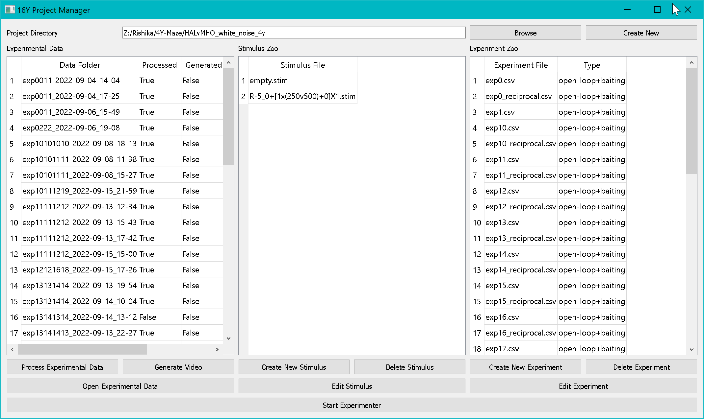

# Stimulus Designer

The **Stimulus Designer** creates LED pulse-pattern stimulus files (`.stim`) that define the timing and intensity of optogenetic light delivery.

---

## Launching

From the Project Manager, click **New Stimulus**, or double-click an existing `.stim` file to edit it.


*The 16Y Stimulus Designer showing a 500 ms red-light pulse with live waveform preview.*

---

## Stimulus Parameters

A stimulus is defined by a train of rectangular pulses:

```
│←delay→│←width→│←─── period ───→│←width→│...
        ▄▄▄▄▄▄▄                  ▄▄▄▄▄▄▄
        │       │                │       │
────────┘       └────────────────┘       └────
```

| Parameter | Description | Units |
|---|---|---|
| **Pulse Width** | Duration of each individual pulse | milliseconds |
| **Pulse Period** | Time from the start of one pulse to the start of the next | milliseconds |
| **Pulse Count** | Number of pulses in the train | — |
| **Pulse Delay** | Delay before the first pulse begins | milliseconds |
| **Pulse Repeat** | Number of times the entire pulse train repeats | — |
| **Dead Time** | Gap between repeats of the pulse train | milliseconds |

### Intensity Settings

Each of the four LED channels (IR, R, G, B) can be independently configured:

| Parameter | Description |
|---|---|
| **IR Intensity** | Intensity of the infrared backlight channel (0–100%) |
| **R Intensity** | Intensity of the red channel (0–100%) |
| **G Intensity** | Intensity of the green channel (0–100%) |
| **B Intensity** | Intensity of the blue channel (0–100%) |

---

## Waveform Preview

The Stimulus Designer renders a live waveform preview of the stimulus in a matplotlib figure as you adjust parameters. This lets you visually verify the pulse train before saving.

---

## Saving a Stimulus

Click **Save** to write the stimulus to a `.stim` file (JSON format) in the project's `stimulus_zoo/` directory.

### File Format

```json
{
  "pulse_width": 10,
  "pulse_period": 50,
  "pulse_count": 10,
  "pulse_delay": 0,
  "pulse_repeat": 1,
  "pulse_deadtime": 0,
  "ir_intensity": 100,
  "r_intensity": 0,
  "g_intensity": 80,
  "b_intensity": 0
}
```

---

## Using Stimuli in Experiments

When designing an experiment (2AFC, DFSE, or DMLE), assign `.stim` files to each outcome:

- **Conditioned Stimulus** — Delivered when the fly makes a specific choice (per arm)
- **Unconditioned Stimulus** — Delivered independently of choice (e.g., as an US in classical conditioning)

The Experimenter loads and parses `.stim` files at runtime and sends the corresponding commands to the LED controller via serial.

---

## Common Stimulus Examples

### Constant Light (Tonic)
- Pulse width = 1000 ms, Period = 1001 ms, Count = 1

### Pulsed (10 Hz)
- Pulse width = 50 ms, Period = 100 ms, Count = 10

### Ramp (via repeats)
- Use multiple stimuli with increasing intensity, triggered sequentially via the unconditioned stimulus mechanism
